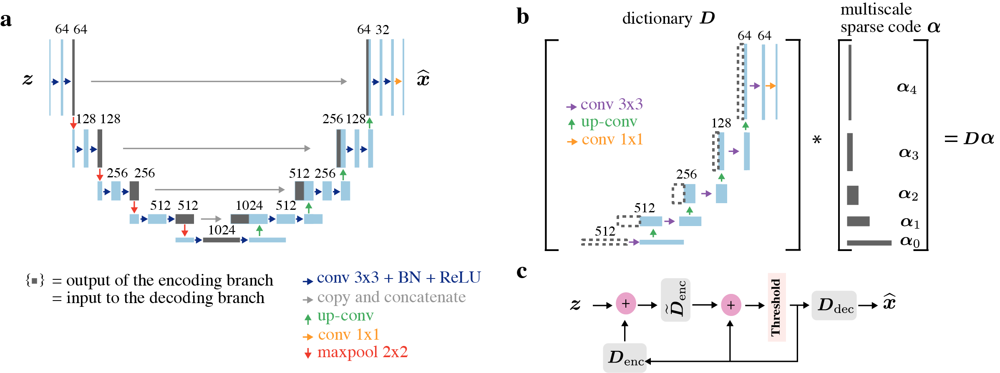

# Learning Multiscale Convolutional Dictionaries for Image Reconstruction

### [Paper](https://ieeexplore.ieee.org/document/9775596) | [Project page](https://sada.dmi.unibas.ch/en/research/ista_unet)

Authors: [Tianlin Liu](www.tianlinliu.com), [Anadi Chaman](https://scholar.google.com/citations?user=HsmT0ggAAAAJ), [David Belius](https://probability.dmi.unibas.ch/belius/), and [Ivan Dokmanić](https://scholar.google.com/citations?user=0SQnwL4AAAAJ&hl=en)


We present a novel multiscale dictionary model that is both simple and mathematically tractable. When trained using a traditional sparse-coding approach, our model performs comparably to the highly regarded U-Net. The figure below illustrates both the U-Net (**panel a**) and our multiscale dictionary model (**panel b**), as well as the forward pass of our model achieved by unrolled task-driven sparse coding (**panel c**).


<p align="center">

</p>

<br />

## Google Colab

If you're interested in experimenting with MUSC, we've prepared two Google Colab notebooks that are very easy to use. There's no need to install anything, and you can run them directly in your browser:

1. Evaluate and visualize a trained MUSC model on the [LoDoPaB-CT dataset](https://zenodo.org/record/3384092) [(Leuschner *et al.*, 2021)](https://www.nature.com/articles/s41597-021-00893-z
)  
    [](https://colab.research.google.com/drive/1zFMbqLVYuvCboW_YJIaFhzPWsnQ1siQG?usp=sharing)

2. Train a small MUSC model from scratch on the [ellipses dataset](https://github.com/panakino/FBPConvNet) [(Jin *et al.*, 2017)](https://ieeexplore.ieee.org/document/7949028/)  
    [](https://colab.research.google.com/drive/1O2LFD0SF-wxUD6rLvnR1Vcam6qCSwg3h?usp=sharing)


<br />

## Installation

If you want to train the model on your own machine, you can use the provided conda environment. 

Create the environment from the environment.yml file

```sh
conda env create -f environment.yml
```

<br />

## Training
To train the MUSC model, use python scripts in the folder `train_src`.

<br />

## Evaluation & checkpoints
The checkpoints for a MUSC model trained on the LoDoPaB-CT dataset are available for download on Google Drive. You can find them [here](https://drive.google.com/file/d/1HKalEjqpDI9OBFpYkSXk_Ma4hqvkOeIX/view?usp=share_link). 

The `notebooks/evaluate_musc_ct.ipynb` notebook can be used to evaluate the model on the test set.

<br />

## Citation

```BibTeX
@ARTICLE{Liu2022learning,
  author={Liu, Tianlin and Chaman, Anadi and Belius, David and Dokmanić, Ivan},
  journal={IEEE Transactions on Computational Imaging},
  title={Learning Multiscale Convolutional Dictionaries for Image Reconstruction},
  year={2022},
  volume={8},
  pages={425-437}}
```
